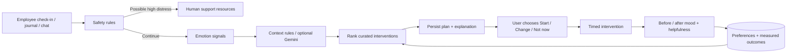

# How MoodMentor works

MoodMentor is a modular monolith: one React application, one FastAPI service, and one relational database. The wellness coordinator is a normal, inspectable Python service. Its agents are focused responsibilities, not separate processes or autonomous actors.

## Responsibilities

| Responsibility | Implementation | Decision basis |
| --- | --- | --- |
| Safety agent | `services/safety_service.py` | Explicit phrase matches; runs before optional provider calls. Can miss or misread context. |
| Emotion agent | `services/emotion_service.py` | Optional GoEmotions; transparent local keyword mode when unavailable. |
| Context agent | `context_agent` | Explicit context, then keyword rules; opt-in Gemini classification constrained to allowed categories. |
| Recommendation agent | `rank_activities` | Time budget, energy, stress, activity preferences, goals, measured outcomes. |
| Coordinator | `coordinate` | Persists check-in, decision trace, activity, rationale, safety state. |
| Intervention agent | Session API + SessionPlayer | User-controlled timer, progress saving, resume, abandon, completion. |
| Follow-up agent | Completion form/API | Requires numeric before/after mood and helpfulness feedback. |
| Progress agent | `progress_summary`, `effectiveness` | Actual completed sessions, local-date streaks, distribution and outcomes. |

## Learning is deliberately simple

Candidate score = context relevance + stated activity preference + goal match + measured outcome contribution. The check-in time budget is persisted and also constrains alternatives. A database constraint allows only one active intervention per user. The outcome contribution is average mood change × `n / (n + 3)`, where `n` is the number of completed sessions of that type. This reduces the influence of tiny samples. A negative average lowers the ranking. Explanatory personal insights require at least three sessions of a type.

The system does **not** train a new neural network, infer a clinical condition, prove causality, schedule background autonomous actions, or optimize employee productivity. Journal/chat messages without a numeric mood rating never create invented chart values. Numeric mood is a self-report on a 1–5 scale, distinct from model valence.

## Data boundaries

- Every private route obtains the current user from a verified JWT; client-provided user IDs are not trusted.
- Wellness plans and sessions are checked against the current user before reading or changing them.
- Team membership has a separate boundary. Team aggregation uses only explicit team submissions; it never queries private sessions or journals.
- Teams require at least five distinct submitters before exposing mood counts or campaign totals. Team notes are not stored because free text can identify people.
- Kudos are explicitly named, opt-in team communications.
- Command-center free text is used for that request and not saved. Journal and chat text are saved as their named features imply.
- Optional Gemini processing is off by default and controlled by each user's profile.

## Integrations

Google uses an authorization-code flow with S256 PKCE, random nonce, signed expiring state, and an atomic one-use state record. The browser retains the verifier and expected state in session storage; the backend verifies both before exchanging the code. Google ID tokens are verified with Google's library against the configured audience and issuer, then checked for nonce and verified email. Sign-in scopes are `openid email profile` only. Access/refresh tokens are not persisted because private Google data is not accessed.

An existing email does not silently link accounts. A local user signs in first, then explicitly links Google from Settings. A Google-only user cannot disconnect their sole sign-in method. Google Photos/Contacts remain unavailable pending a separately consented narrow picker integration. The original mock-token bypass and broad library access code were removed.

Reference: [Google web-server OAuth](https://developers.google.com/identity/protocols/oauth2/web-server), [OpenID Connect](https://developers.google.com/identity/openid-connect/openid-connect), [Photos API changes](https://developers.google.com/photos/support/updates).

Maps, Spotify, and YouTube are explicit outbound search links. They are not represented as connected accounts or API-backed recommendations.

## Auth and production trade-offs

Passwords use bcrypt and a UTF-8 byte limit. JWTs last one hour. Production startup requires a secret of at least 32 characters; development can use a random process-lifetime key. Tokens live in browser session storage, not persistent local storage. This reduces persistence but does not protect against XSS. A mature deployment should move to same-origin secure HttpOnly cookies with CSRF defenses, rotation, revocation, recovery, and verified email. The current session-storage choice keeps bearer API clients simple and is documented rather than portrayed as equivalent to enterprise identity infrastructure.

The in-process IP request limiter is a basic single-instance guard. Multiple workers require a shared gateway rate limiter. SQLite is appropriate locally; SQLAlchemy models and additive migrations use portable column types. PostgreSQL needs its own driver, migration testing, backups, and deployment procedures. There is no manager access to personal wellness histories.

## Safety and external delivery

Safety words cause an immediate support-oriented plan, with no activity selected as a substitute for human help. Clinical/contextual safety evaluation is not implemented; the classifier is not medically validated. Contact details can be saved and used to open a user's calling app. External delivery has no configured provider and honestly returns `success: false`. No automatic notification is offered. The API rejects an automatic-notification preference while that capability is unavailable.

Resources were checked on 2026-09-13 against [India's Tele-MANAS program](https://dghs.mohfw.gov.in/national-mental-health-programme.php) and [112 emergency services](https://112.gov.in/). Operators should periodically verify resources, localize them for deployment regions, and obtain an expert safety review before broader use.
